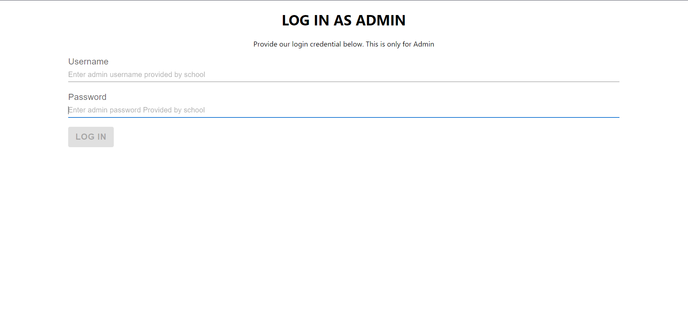
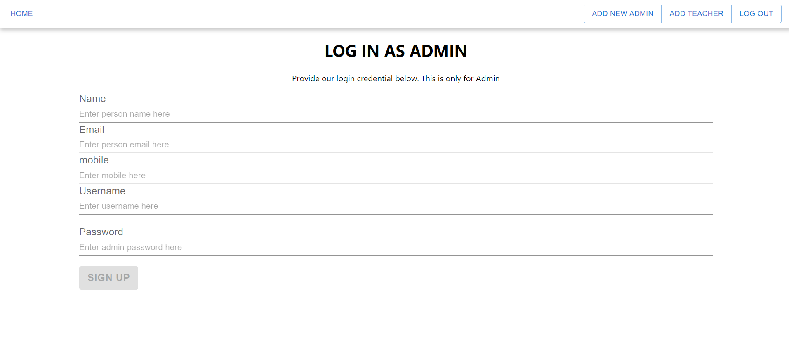
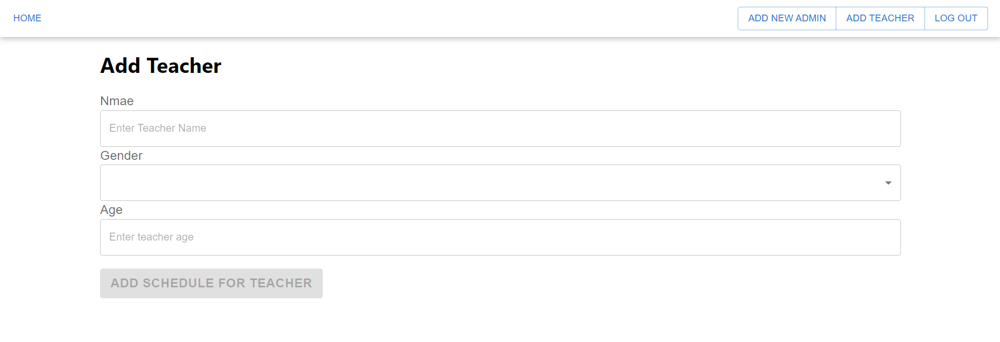
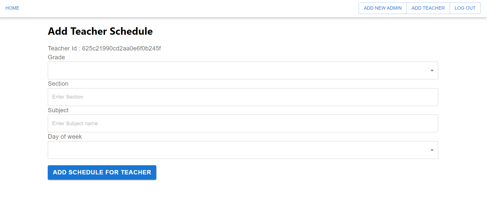
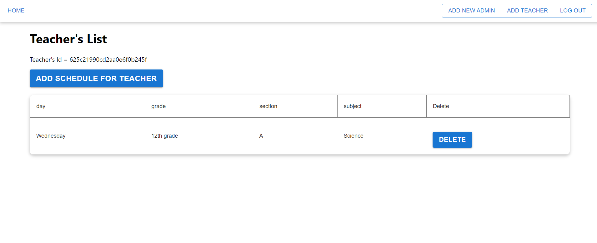

<h1 align="center">Teacher Manager (School Admin Application)</h1>
<h4 align="center">This is a school admin page. In this page you admin can make a watch on teacher and scheduled classes. At first you have to log in as a admin you can use given credential to login to this application.</h4>

<strong>For reference you visit this videos:-</strong> <a href="https://drive.google.com/drive/folders/1PTASkKVn_9I3pf6jEXbss0gxEO46oxBE?usp=sharing">CLICK ME</a>

<strong>Login Credential :- </strong>
 
<ul>
 <li>usename: deepanshu123</li>
 <li>password: teach@1234</li>
</ul>
 
<strong>Tech Stack :- </strong>
 
<ul>
 <li>React | Redux | Material UI | Express | MongoDB | Node.js | Javascript | HTML | CSS</li>
</ul>

 # Features

- ## Login

 

- ## Home

 

- ## Add new admin

 

- ## Add new teacher

 

- ## Add schedule for teacher

 

- ## Teacher scheduled lectures page

 

